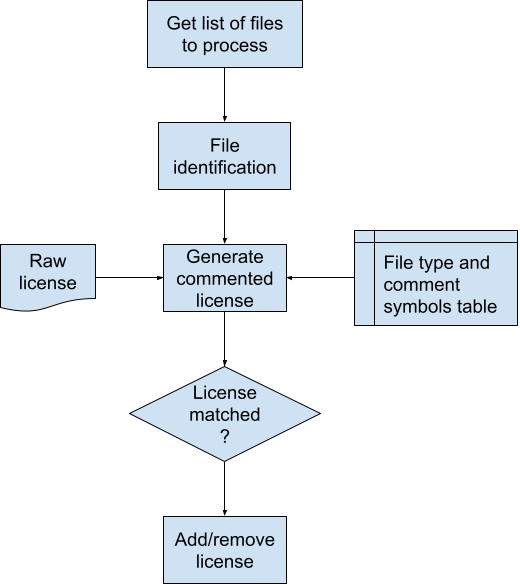

# Licenser

Utility to add/remove licenses to/from source files.
Supports processing any combination of globs, files, and directories (recurse).
Pruning options allow skipping non-licensing files.


# Workflow

`licenser` uses file identification techniques to infer the format of the license.
Mainly, resolves how text is commented for that particular source file.
Then, string matching is used to detect the presence of the license in source files.
This allows `licenser` to be an idempotent operation.



## Grammar of source file comments

Commented text in source code can be represented by the location and form of the comment symbols (`symbol`) and whitespaces (`ws`).
More generally, most commenting syntaxes conform to the following form:
```
<open_block>
<line_prefix><text>
...
<line_prefix><text>
<close_block>
```

### Prefix lines

This model consists of fixed comment symbols and whitespaces that are prefixed to each line of text: `<line_prefix> = <symbol><ws>`
```
<symbol><ws><text>
...
<symbol><ws><text>
```

### Open/close block

This model consists of enclosing comment symbols applied to the entire text: `<line_prefix> = <ws>`, `<open_block> = <open_symbol><block_ws>`, and `<close_block> = <block_ws><close_symbol>`
```
<open_symbol><block_ws>
<ws><text>
...
<ws><text>
<block_ws><close_symbol>
```


# Design

## FileIdentificator

Checks several file properties to identify its type:
* file extension
* magic number
* script she-bang
* filename

## Commenter

Given a text and a file type, adds/removes commenting symbols to/from the text.

## Licenser

Adds/removes license to/from files.
License is mostly placed at top of file except for scripts which it is placed after she-bang lines.


# Requirements

* Python 3.6+
* libmagic installed for OS
* [python-magic 0.4+](https://pypi.org/project/python-magic)


# Usage

```shell
python3 licenser.py --help
```

List the C++ source files to add license to:
```shell
python3 licenser.py --list-files --license-file raw_license.txt --recurse --sources /search/dir1 /search/dir2 "*.cc"
```

Add license to C++ source files:
```shell
python3 licenser.py --license-file raw_license.txt --recurse --sources /search/dir1 /search/dir2 "*.cc"
```

Remove license from C++ source files:
```shell
python3 licenser.py --delete --license-file raw_license.txt --recurse --sources /search/dir1 /search/dir2 "*.cc"
```
